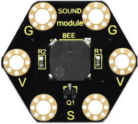
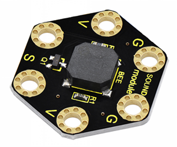
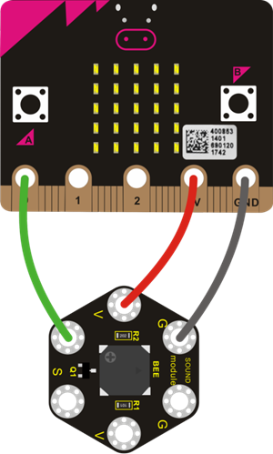
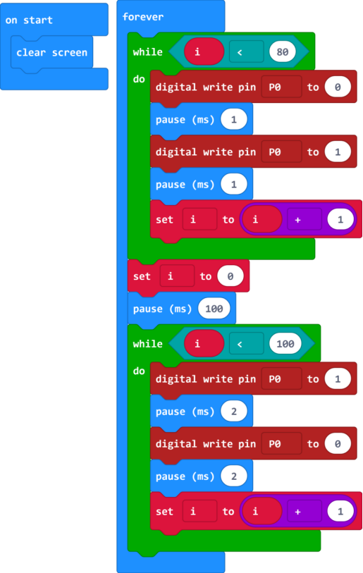
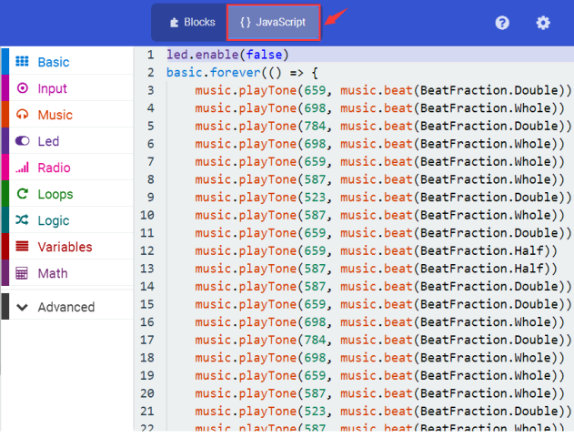
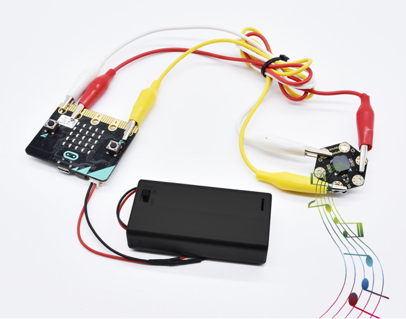

# KS0424 keyestudio micro:bit Passive Buzzer Module

## 1. Description

This Keyestudio passive buzzer module is fully compatible with micro:bit control boards.

Composed of a passive buzzer without oscillation circuit, it cannot be actuated by itself, but by external pulse frequencies. Different frequencies produce different sounds as well as the melody of a song.

There are total 6 gold-plated rings on the module. Note that two G rings, two V rings and two S rings are connected. G is for ground; V for 3V; S for signal pin(0 1 2).

When using it, you need to connect it to a micro:bit control board through crocodile clip lines.

## 2. Technical Parameters

- Working voltage: DC 3.0-3.3V
- Output signal: Digital signal (square wave)
- Dimensions: 31mm * 27mm * 4.5mm
- Weight: 2.3g
- Environmental attributes: ROHS

## 3. Connection Diagram

## 4. Source Code

Download code : [Code](./Code.7z)

**Code 1：**

**Code 2：**

**Note:**

If you drag the source code we provided to the Microsoft MakeCode Block editor https://makecode.microbit.org/#editor.

Click the iconto check the frequency of each tone as follows:

## 5. Example Result

Connect well the module, then send the source code to the micro:bit main board.

If send the code 1, the buzzer will alternately make two sounds. If send the code 2, the buzzer will play a song of Ode To Joy.

